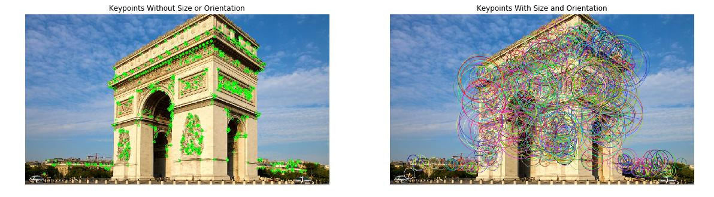

# KEYPOINTS DETECTION USING ORB

Here I use the ORB Algorithm which is a Keypoint-based algorithm to recognize object or faces very quickly. 
We can easily use this algorithm in real time video stream as here.

See the result <a href="https://www.instagram.com/p/BvjrjKhIUgL/">here</a>

## File Description
- haarcascade_frontalface_default.xml: Cascade file for detecting the face part before recognition 
- orb.py: orb algorithm for face recognition in real time
- Notebook_PDF/preliminary.pdf: test for detecting keypoints in image (PDF version of a Notebook)

## Authors
Medhy Vinceslas

## License
Project under the <a href='https://choosealicense.com/licenses/cc0-1.0/'>CC0-1.0</a> License

## Acknowledgement
Thank you to the @udacity staff for giving me the opportunity to build this.

